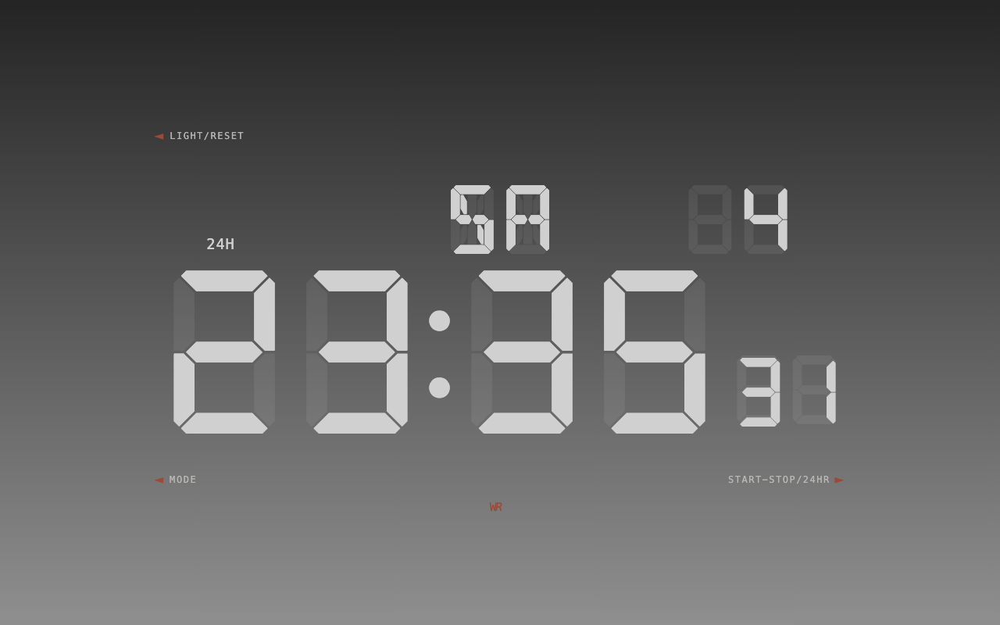
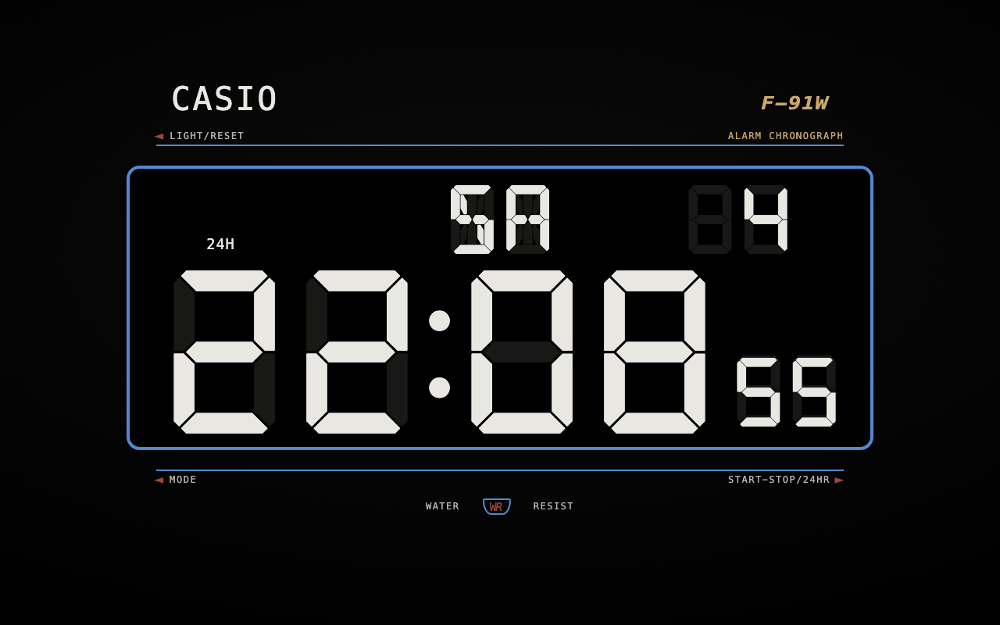
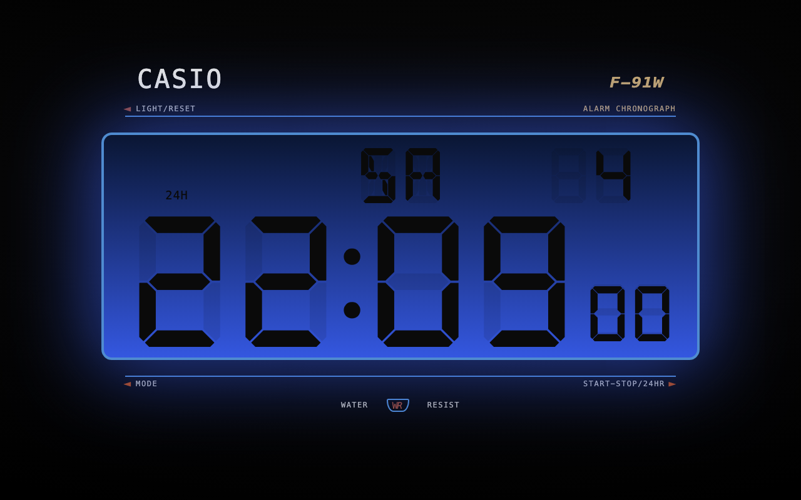
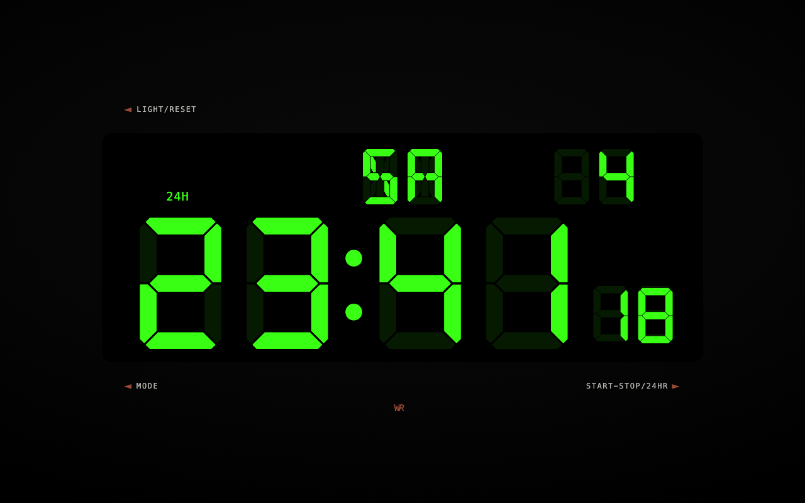
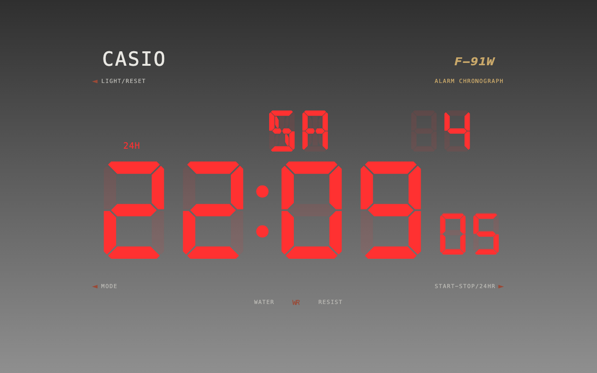

<h1 align="center">Chrome New Tab inspired by Casio F-91W</h1>

  I wanted a cool watchface as the new-tab page, and what better watchface than the iconic Casio F-91W. So I created this chrome extension.

  

  

  
  

  
  

## Features

- **Clock** — segmented `HH:MM` + seconds, day-of-week and date, `24H` / `AM·PM`.
- **Stopwatch** — `MM:SS` with live centiseconds; rolls up into hours and days.
- **Timer** — set a duration as **days + HH:MM:SS** with the arrow keys, or pick an
  exact **deadline date & time** to count down to. The active deadline is shown at
  the bottom, and because it's an absolute target it keeps running across new tabs
  and even survives closing and reopening the browser.
- **Neon themes** — click the **WR** badge to open in-place colour editing:
  - top & bottom of the **LIGHT** gradient, the **digit** colour, and the **border** colour
  - a **brightness** slider for the backlight
  - a **transparent border** that dissolves the whole page into one glowing LCD
  - a **CLEAN** mode that hides the branding for a minimal face
  - one-click **RESET**
- **Everything persists** — theme, backlight, mode, and the running timer/stopwatch
  are saved locally and synced live across open tabs.
- **Fully responsive**, from a small window to fullscreen.

## Controls

The three watch buttons are context-sensitive:

| Button | Clock | Stopwatch / Timer |
|--------|-------|-------------------|
| **LIGHT / RESET** | toggle backlight | reset |
| **MODE** | — | cycle Clock → Stopwatch → Timer |
| **START-STOP / 24HR** | toggle 24H / 12H | start / stop |

**Keyboard:** `←/→` pick a timer field · `↑/↓` adjust it · `Space` start-stop · `L` toggle light.

## Install

**From the Chrome Web Store** (recommended):
[**F-91W New Tab**](https://chromewebstore.google.com/detail/f-91w-new-tab/ooeppkhfdocdaahjinlflfohpalmfaln)

**Or load unpacked** (for development):

1. Clone or download this repo.
2. Open `chrome://extensions` and enable **Developer mode** (top-right).
3. Click **Load unpacked** and select this folder.
4. Open a new tab.

Works in Chrome, Edge, Brave, and any Chromium browser (Manifest V3).

## Credits

- [DSEG (keshikan)](https://www.keshikan.net/fonts-e.html)
- [Manz.dev's Casio F-91W CodePen](https://codepen.io/manz/pen/KKWmWLb)

## License

[MIT](LICENSE)
