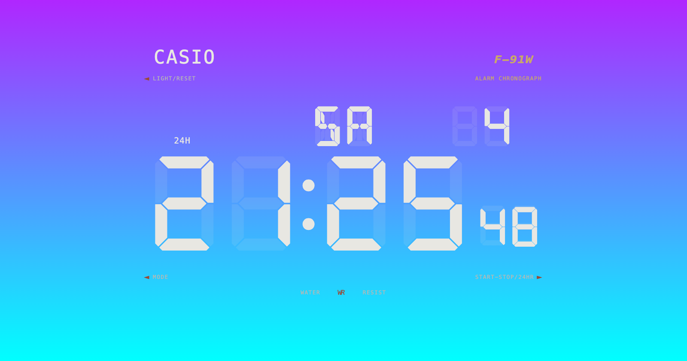
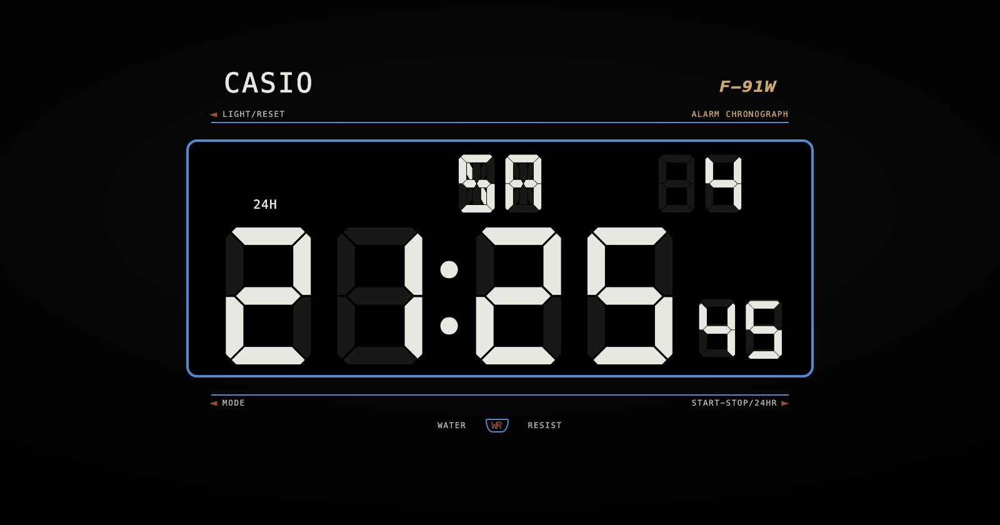

<h1 align="center">F-91W New Tab ⌚</h1>

  A faithful <b>Casio F-91W</b> LCD for your browser's new-tab page — 
  a live segmented clock, a stopwatch, a days-capable timer, and fully themeable neon backlights.

  

  
  

---

Every new tab becomes the watch. Pure **HTML / CSS / vanilla JS** — no framework, no build step, no backend, no tracking. The real **DSEG7 / DSEG14** segment fonts are bundled locally, and every cell is a fixed segment matrix (with visible "ghost" unlit segments) so nothing ever reflows between modes — just like a real LCD.

## Features

- **⏰ Clock** — segmented `HH:MM` + seconds, day-of-week and date, `24H` / `AM·PM`.
- **⏱ Stopwatch** — `MM:SS` with live centiseconds; rolls up into hours and days.
- **⏳ Timer** — set **days + HH:MM:SS**; edit each field with the arrow keys.
- **🎨 Neon themes** — click the **WR** badge to open in-place colour editing:
  - top & bottom of the **LIGHT** gradient, the **digit** colour, and the **border** colour
  - a **brightness** slider for the backlight
  - a **transparent border** that dissolves the whole page into one glowing LCD
  - one-click **RESET**, and everything persists locally
- **Fully responsive**, from a small window to fullscreen.

## Controls

The three watch buttons are context-sensitive:

| Button | Clock | Stopwatch / Timer |
|--------|-------|-------------------|
| **LIGHT / RESET** | toggle backlight | reset |
| **MODE** | — | cycle Clock → Stopwatch → Timer |
| **START-STOP / 24HR** | toggle 24H / 12H | start / stop |

**Keyboard:** `←/→` pick a timer field · `↑/↓` adjust it · `Space` start-stop · `L` toggle light.

## Install (Load unpacked)

1. Clone or download this repo.
2. Open `chrome://extensions` and enable **Developer mode** (top-right).
3. Click **Load unpacked** and select this folder.
4. Open a new tab. 🎉

Works in Chrome, Edge, Brave, and any Chromium browser (Manifest V3).

## Credits

The LCD watch-face design is ported and heavily restyled (screen only, re-themed) from
[**Manz.dev**'s Casio F-91W CodePen](https://codepen.io/manz/pen/KKWmWLb).
Segment fonts by [DSEG (keshikan)](https://www.keshikan.net/fonts-e.html), SIL Open Font License.

## License

[MIT](LICENSE)
